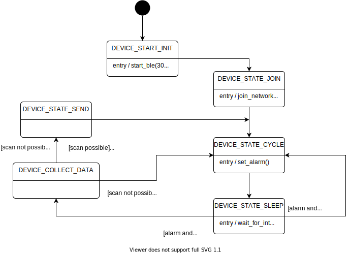

# Tracker application 

## 1. Description

This application automatically submits a Join-Request to the LoRa Network Server.

When connected, it performs Wi-Fi Scans, GNSS scans and various sensor measurements. The scanned data is then streamed using the Device And Application services from LoRa Cloud.

## 2. Configuration

### 2.1. LoRaWAN Configuration

The `main_tracker.h` header file defines several constants which value can be set to define the LoRaWAN configuration of the application.

Note: the constants described below define the default value for a configuration option. If the Tracker application has already been configured it will ignore this default value and keep on using the previously configured value. You will need to set the `FORCE_NEW_TRACKER_CONTEXT` constant to one if you want the application to use the new default configuration options.

| Constant              | Comments |
| --------------------- | -------- |
| `LORAWAN_REGION_USED` | Select the regulatory region. |
| `LORAWAN_CLASS_USED`  | LoRaWAN device class. |
| `LORAWAN_DUTYCYCLE_ON` | Enable/disable the Duty Cycle |

Supported values for `LORAWAN_REGION_USED`:

* `LR1110_LORAWAN_REGION_EU868 (default)`
* `LR1110_LORAWAN_REGION_US915`
* `LR1110_LORAWAN_REGION_AU915`
* `LR1110_LORAWAN_REGION_CN470`
* `LR1110_LORAWAN_REGION_AS923_GRP1`
* `LR1110_LORAWAN_REGION_AS923_GRP2`
* `LR1110_LORAWAN_REGION_AS923_GRP3`
* `LR1110_LORAWAN_REGION_IN865`
* `LR1110_LORAWAN_REGION_KR920`
* `LR1110_LORAWAN_REGION_RU864`

Supported values for `LORAWAN_CLASS_USED`:

* `LR1110_LORAWAN_CLASS_A (default)`
* `LR1110_LORAWAN_CLASS_C`

### 2.2. Join configuration

The LR1110 is pre-provisioned with a ChipEUI/DevEUI and a JoinEUI. The application will use these identifiers if the `USE_PRODUCTION_KEYS` is equal to one. 

Alternatively, you can provide your own EUIs in `Inc/apps/lorawan_commissioning/lorawan_commissioning.h` by setting `USE_PRODUCTION_KEYS` to any other value and by changing the values of `LORAWAN_DEVICE_EUI` and `LORAWAN_JOIN_EUI` and `LORAWAN_APP_KEY`.

## 3. Miscellaneous

### 3.1. Application main loop

The application puts the STM32 MCU to sleep after setting an alarm. The MCU is taken out of sleep either by the alarm.

### 3.2. Application Watchdog

The application initializes and start the watchdog timer of the STM32 host MCU just before entering the main processing loop. This ensures that the MCU would reset and the application would restart if the the watchdog timer were not reset before is elapses. This forms a protection against the MCU not waking up from its sleep state.

### 3.3. LEDs

There are three LEDs on the LR1110 shield:

* RX (green)
* TX (red)
* Sniffing (amber)

The application uses the LEDs of the LR1110 shield to display the following events:

* application startup: all three LEDs blink twice with a 100 ms period.
* clock synchronized: the RX LED blinks four times with a 100 ms period.
* clock unsynchronized: the TX LED blinks four times with a 100 ms period.
* uplink frame sent: the TX LED flashes once. The duration of the event can be configured with the `LED_PERIOD_MS` constant.
* downlink frame received: the RX LED flashes once. The duration of the event can be configured with the `LED_PERIOD_MS` constant.
